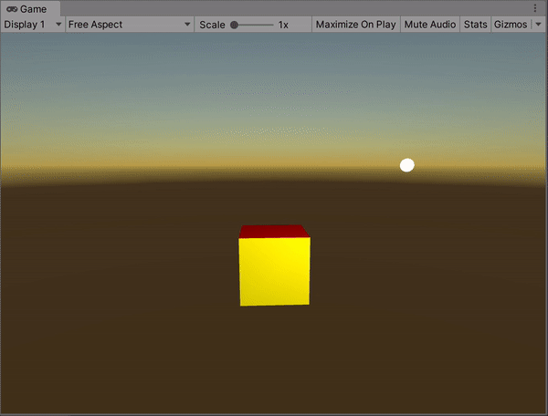
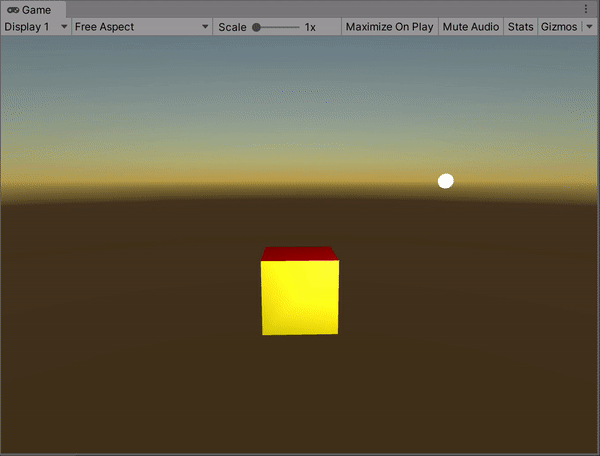
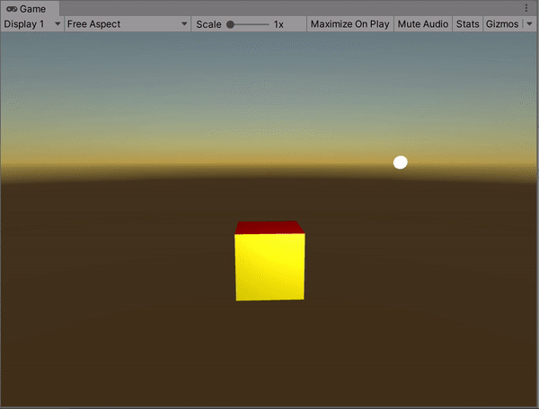
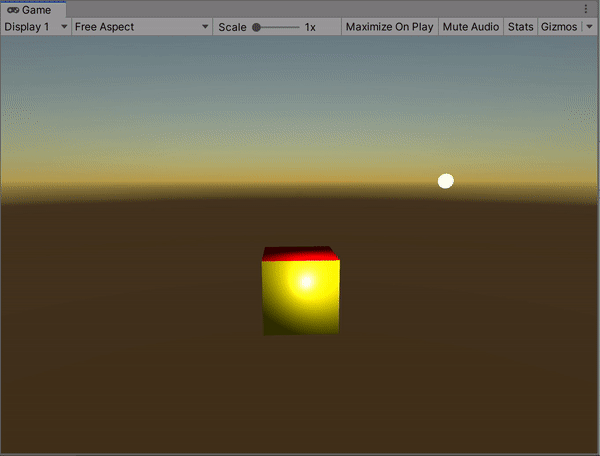

**The University of Melbourne**
# COMP30019 – Graphics and Interaction

## Workshop 6

# Introduction:

In this lab you will be investigating the Phong illumination model implemented via a custom Cg/HLSL shader in Unity.

# Tasks:

1. Open `MainScene.unity` in Unity. Press the ‘Play’ button. Notice that the cube drawn is not illuminated (only the ambient component is visible). This is because the surface normals haven’t been properly defined yet. Modify the cube such that correct surface normals are being used for all faces.

  

2. Specular reflection currently isn't being implemented. (Why not?) Sketch out how you would perform the missing calculation to finish implementing specular reflection. Additionally, read up (e.g. on Wikipedia) on the Blinn-Phong shading model, which gives a typical solution to this problem.

  

3. Write a new shader called `PhongShader.shader` which uses Phong shading instead of Gouraud shading. Think about where most of the lighting calculation logic should be (i.e. vertex or fragment shader), and base it off the Gouraud shader accordingly.

  

4. Modify the cube such that vertex normals are used instead of surface normals.

  

5. **Challenge** Modify the Phong shader so that textures are used instead of vertex colours.

6. **Challenge** The ‘PointLight’ entity that is presently used is not a standard Unity light.
Investigate how you could modify or extend the Phong shader to incorporate Unity lights.

